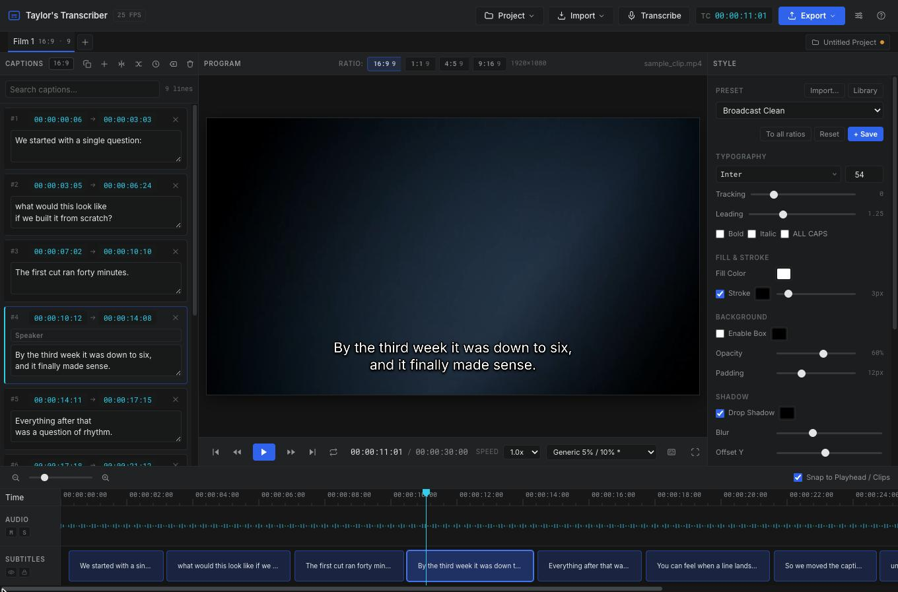
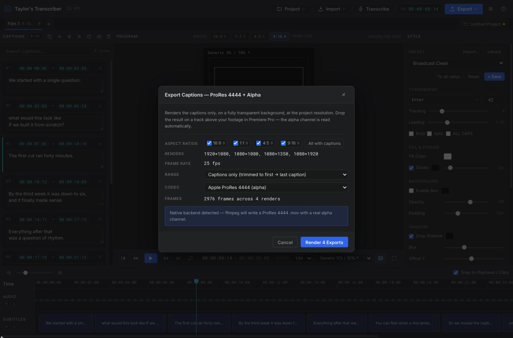
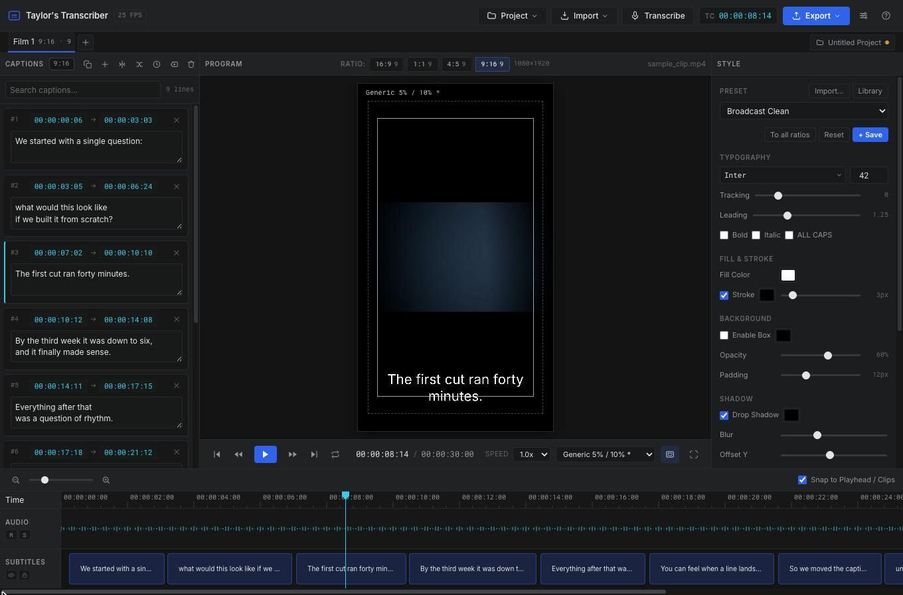
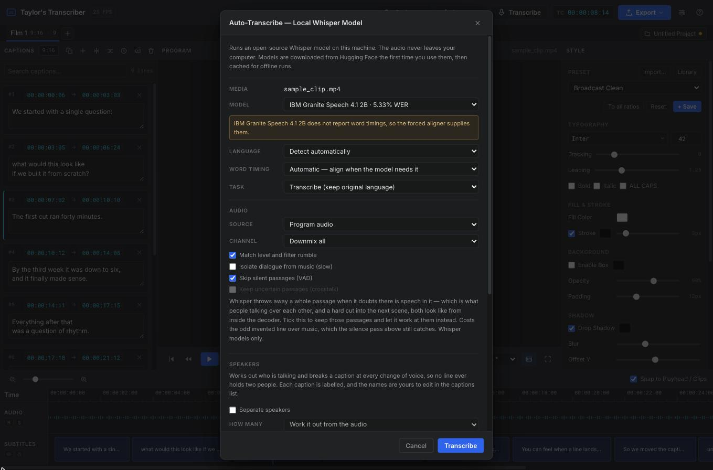
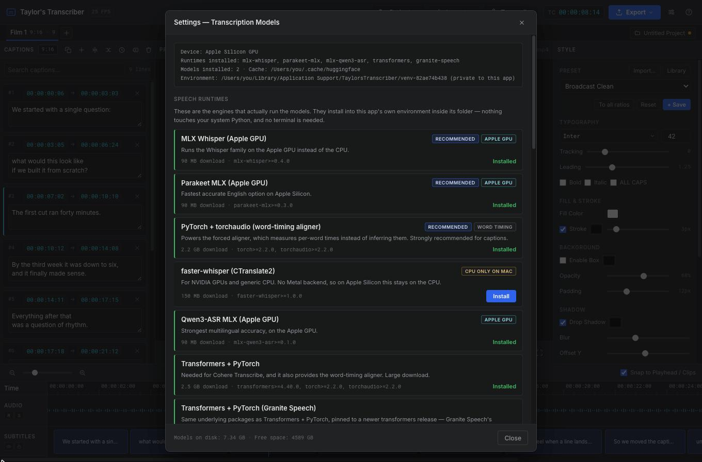

# Taylor's Transcriber

A Premiere Pro–style captions editor whose point of difference is the export:
captions render straight to **Apple ProRes 4444 with a real alpha channel**, so
they drop onto a track above your footage and composite cleanly — no keying, no
burned-in text.




*The caption list, the program monitor and the style panel, over a timeline that carries the waveform and one block per caption.*

## Installing

Download it from [Releases](https://github.com/Taylor-VN/taylors-transcriber/releases)
and open it. There is nothing else to install — no Python, no ffmpeg, no
terminal.

| Platform | Download | What to do |
| --- | --- | --- |
| macOS 11+ (Apple Silicon) | `.dmg` | Open it, drag the app to Applications |
| Windows 10/11 (64-bit) | `-setup.exe` | Run it — installs for you only, no administrator prompt |
| Linux (x86_64) | `.AppImage` | `chmod +x` it, then run it once |

The Linux build targets glibc 2.28, so it runs on Rocky Linux 8 and 9, RHEL,
Fedora and Ubuntu 20.04 upwards. Running the AppImage installs it to
`~/.local/share/taylors-transcriber` and adds it to your applications menu, so
you only need the downloaded file once and can delete it afterwards.

Everything heavier — the speech runtimes and the word-timing aligner — installs
on a button click in **Settings**, into a private environment the app owns.
**Nothing is ever installed into your system Python.**

### First launch

These builds are not signed with a paid developer certificate, so each system
asks once whether you meant it:

- **macOS** — the app is blocked as unverified. Go to **System Settings →
  Privacy & Security**, scroll down and choose **Open Anyway**. Or clear the
  quarantine flag yourself:
  `xattr -dr com.apple.quarantine "/Applications/Taylor's Transcriber.app"`
- **Windows** — SmartScreen shows a blue panel. Click **More info**, then
  **Run anyway**.

### Updating

Install the new version over the top. Your downloaded models and the speech
runtimes you installed are kept — they live outside the app, and the installers
do not touch them.

## Running from source

The installers are the easy path, but the app runs perfectly well from a
checkout, which is how to develop it.

| Platform | Launch |
| --- | --- |
| macOS | `./run_subtitler.sh`, or double-click **Taylor's Transcriber.command** |
| Linux | `./run_subtitler.sh` |
| Windows | double-click **run_subtitler.bat** |

On the first run the app creates its own virtual environment and installs its
base dependencies there. Later runs skip straight to launching. This also
sidesteps the `externally-managed-environment` refusal (PEP 668) that Homebrew
and Debian Python give when you pip-install globally.

Only Python 3.9+ is required on the machine. If it is missing, the launcher tells
you how to get it.

To build the installers yourself, see [RELEASING.md](RELEASING.md).

### Where the environment lives

Not next to the project. It goes in your per-user application-support directory
on the **boot volume**:

| Platform | Location |
| --- | --- |
| macOS | `~/Library/Application Support/TaylorsTranscriber/` |
| Linux | `~/.local/share/taylors-transcriber/` |
| Windows | `%LOCALAPPDATA%\TaylorsTranscriber\` |

An installed copy uses `venv` there — one identity, one environment, whatever
folder it was installed into, which is what lets an update keep the runtimes you
downloaded. A source checkout uses `venv-<hash of the checkout path>`, so
several clones never share one.

This is deliberate, not tidiness. **macOS refuses to load native libraries from
external and network volumes** — you get `library load disallowed by system
policy`. Editing projects normally live on big external drives, and an
environment sitting beside one cannot load PyObjC, which leaves pywebview with no
GUI backend and the app unable to open a window at all. Keeping the environment
on the boot volume avoids that entirely, while the project itself can live
wherever you like.

Override it with `TRANSCRIBER_VENV=/path/to/env` if you need to. If you have an
old in-project `.venv` from an earlier version, the launcher will tell you it is
no longer used and can be deleted.

### If the window will not open

The app never dies with a stack trace over this. If no native GUI backend can be
loaded it prints the reason and **falls back to your default browser**, serving
the interface from `127.0.0.1`. Exporting and transcription still work in that
mode — the backend is exposed over a localhost bridge that requires a
per-launch token — the only difference is that text exports download through the
browser instead of using a native save dialog.

Force that mode with `./run_subtitler.sh --browser`.

### macOS: "cannot be opened because it is from an unidentified developer"

For the installed app, see [First launch](#first-launch) above. Running from
source, Gatekeeper blocks double-clicking an unsigned `.command` file, so
either:

- **right-click** the file → **Open** → **Open** (the sanctioned one-time
  override), or
- run it from Terminal with `./run_subtitler.sh`, which is not subject to that
  check, or
- clear the quarantine flag on your own copy:
  `xattr -d com.apple.quarantine "Taylor's Transcriber.command"`

### ffmpeg (for the ProRes export)

**The installers include it** — there is nothing to do.

Running from source, the alpha export shells out to `ffmpeg`, which is a system
binary rather than a Python package:

| Platform | Command |
| --- | --- |
| macOS | `brew install ffmpeg` |
| Debian/Ubuntu | `sudo apt install ffmpeg` |
| Windows | https://www.gyan.dev/ffmpeg/builds/ |

Without it the export still works, but falls back to a ZIP'd transparent PNG
sequence plus the exact ffmpeg command to convert it yourself.

## Projects and films

A **project** is one job. Inside it sits a list of **films** — the separate
edits you are delivering for that job: a 60, a 30, a different cut. Each film
owns its own media and its own transcription.

A film is **not** tied to an aspect ratio. Every film carries a caption set for
each of the four ratios, so one edit is delivered in all of them. The ratio
buttons over the program monitor (and `1`–`4`) choose which of those caption
sets you are editing; each keeps its own line breaks, its own timing tweaks,
its own caption style and its own safe-area guides. That is the point — a 9:16
frame wants shorter lines and a higher margin than a 16:9 one, from the same
words.

Which captions are shared and which are not follows one rule:

| Where captions come from | Where they land |
| --- | --- |
| Transcription, imported SRT/VTT/JSON | **every ratio** — one soundtrack, one set of words |
| Typing, splitting, merging, dragging a clip, ripple delete, Clear all | **the ratio you are in** |

When a fix does need to travel, the copy button in the Captions panel header
pushes the current ratio's captions over the other three, and **To all ratios**
in the Style panel does the same for the caption style. Both ask first, because
both discard the other ratios' work.

The strip under the toolbar is the film list. Click a tab to switch to that
edit — the program monitor, the caption list, the timeline and the style
inspector all repoint to it at once. `[` and `]` step through the tabs.
Double-click a tab to rename it, and the `+` at the end adds a film.

**Project → Duplicate Film** copies an edit whole — every ratio's captions and
style, plus the media link — which is the quick way to start a second cut from
the first.

### Saving a project

**Project → Save Project** (`Ctrl/⌘ S`) writes every film in the job to a single
`.ttproj` file. Save As (`Ctrl/⌘ ⇧ S`) writes a new one; a plain Save after that
overwrites it silently. `Ctrl/⌘ O` opens one, and a `.ttproj` dropped on the
program monitor opens too.

The file is plain JSON and holds every ratio's captions, style and guide choice
for every film, plus the segmentation settings and the raw transcription — so
the segmentation sliders still re-cut an old job without re-running a model.
Projects written by the earlier single-ratio format open too: the film's old
ratio becomes the one it opens on, and its captions are copied into the other
three so it gains the remaining shapes.

**It does not hold the video.** A project file has to stay a text file rather
than a copy of the rushes, so a reopened project shows *n films need media* in
the film bar. **Project → Relink Media…** takes the files back: they are matched
to the films by filename first, then whatever is left is handed to the still-
waiting films in order, so a renamed file does not leave you stuck. One file can
back several films, which is what a duplicated edit needs.

Exports are named from the job, the edit and the ratio —
`Acme_Launch_Hero_60_9x16.srt` — so a folder of deliverables cannot collapse
into one `subtitles.srt` overwriting itself.

The current project is also autosaved to the browser's local storage after every
edit and reopened at launch, so closing the app does not lose work that was
never written to a file. That is a safety net, not a substitute for saving —
it holds one project and lives with the app, not with the job.

## Aspect ratios

| Ratio | Resolution | |
| --- | --- | --- |
| 16:9 | 1920 × 1080 | key `1` |
| 1:1 | 1080 × 1080 | key `2` |
| 4:5 | 1080 × 1350 | key `3` |
| 9:16 | 1080 × 1920 | key `4` |

Each button carries the number of captions that ratio holds, so you can see at
a glance which shapes of a film are finished.

Everything is drawn at the project resolution and the preview is a scaled copy
of it, so the Program Monitor is pixel-for-pixel what gets exported. Preset
style values (font size, margins, stroke, shadow) are referenced to a
1080-pixel-tall frame and scaled, so a style looks proportionally the same in
every ratio before you tune it for one.

### Exporting every ratio at once

The ProRes + alpha dialog opens on a row of ratio checkboxes. Tick as many as
you like — **All with captions** selects every ratio that has any — and one
render run writes one file per ratio, each named for it. Ratios with no
captions are disabled rather than silently rendering a file of pure
transparency.



*One run, four files. The dialog counts the frames it is about to render and says which backend will write them.*

Each ratio is rendered by genuinely switching the editor to it, so every file
in the set is drawn by the same code that drew the preview you approved. The
editor returns to the ratio you started on when the run ends, including after
a failure.

## Safe areas

`G` toggles the guides; the dropdown beside the button picks the set, and the
choice is remembered per ratio — EBU on the 16:9 deliverable, TikTok on the
vertical one — and saved with the project. Only sets that apply to the current
ratio are offered.

Two things are drawn. The solid box is the line to keep text inside. The
hatched amber regions are where the platform's own interface sits on top of the
video, which is a stronger claim than "might be cropped" — anything there is
covered, not merely tight.



*The same film in 9:16, with guides on. Each ratio keeps its own line breaks, its own style and its own guide set.*

| Set | Ratio | Basis |
| --- | --- | --- |
| Generic 5% / 10% | any | the old 4:3-era convention, kept as a neutral default |
| EBU R95 | 16:9 | 5% graphics safe area, with the 3.5% action safe area outside it |
| YouTube | 16:9 | clear of the progress bar and the cards/share affordances |
| YouTube Shorts | 9:16 | title and channel block, action rail |
| Instagram Reels | 9:16 | 14% top, 35% bottom, 6% each side |
| Instagram Stories | 9:16 | 14% top, 35% bottom, 6% each side |
| TikTok | 9:16 | 130 top, 484 bottom, 44 left, 140 right on 1080 × 1920 |

EBU R95, both Instagram sets and TikTok come from published specs. The three
marked with an asterisk in the dropdown — Generic and both YouTube sets — are
measured instead, because Google publishes a reference image rather than
figures. Apps redesign; re-check those before trusting them on a delivery.

Two caveats worth knowing. Meta quotes one safe zone for Stories and Reels
alike, and it is the *ads* figure, so the 35% at the bottom is reserving room
for a call-to-action button you may not have — the sets stay separate because
the hatched interface zones above and below still differ. And the published 6%
at the sides does not clear the organic action rail, which is why the hatching
on the right crosses the box; keep clear of both.

All of them live in one table at the top of `js/safeAreas.js`, so correcting a
number is a one-line change.

## AI transcription

Press **Transcribe** (or `T`) to auto-caption the loaded media with an
open-source model running **entirely on your own machine** — the audio is never
uploaded anywhere. Models are installed and removed from **Settings** (`,`).



*The transcribe dialog says what the chosen model can and cannot do — here, that its word timings come from the forced aligner instead.*

### Pick the runtime before the model

On Apple Silicon this matters more than the model choice. CTranslate2 — what
`faster-whisper` is built on — has **no Metal backend**, so it runs on CPU cores
only and leaves the GPU idle. The MLX runtimes use the Apple GPU:

| Runtime | Download | Use it for |
| --- | --- | --- |
| MLX Whisper | 90 MB | Whisper family, Apple GPU |
| Parakeet MLX | 90 MB | Fastest accurate English, Apple GPU |
| Qwen3-ASR MLX | 90 MB | Strongest multilingual, Apple GPU |
| Transformers + PyTorch | 0.9–3.6 GB | Cohere Transcribe, Granite Speech |
| faster-whisper | 150 MB | The Whisper family on Windows and Linux; NVIDIA GPUs |
| SpeechBrain | 0.9–3.6 GB | Speaker separation (shares torch with the aligner) |

The torch-based runtimes vary that much because of what PyPI serves: Linux gets
the CUDA build and its NVIDIA libraries whether or not there is a card in the
machine, Windows gets a CPU build a quarter of the size. Settings shows the
figure for the machine it is running on.

Install these from **Settings → Speech Runtimes**. "Install recommended setup"
picks the right set for the machine it is running on — the GPU runtimes plus the
aligner on Apple Silicon, faster-whisper plus the aligner elsewhere. Settings
also warns you if the only runtime present is the CPU-bound one, and only offers
runtimes that exist for your platform.



*Runtimes and models install on a button click, into the app's private environment — no terminal, and nothing added to your system Python.*

### Choosing a model

| Model | Strength | Timings | Runs on |
| --- | --- | --- | --- |
| Qwen3-ASR 1.7B | SOTA multilingual; clearly ahead on Mandarin, noisy and accented speech | needs aligner | Apple Silicon |
| IBM Granite Speech 4.1 2B | Lowest reported English WER of those listed | needs aligner | all |
| Cohere Transcribe 2B | Apache 2.0; topped Open ASR for English, strong across 13 more languages | needs aligner | all |
| NVIDIA Parakeet TDT 0.6B v2 | Very strong English, by far the fastest accurate option on Apple Silicon | own timings | Apple Silicon |
| Whisper large-v3 / turbo / medium / small / tiny | 99 languages, solid baseline; turbo is ~8× faster | own timings | all |

The Whisper family ships in two weight formats, so it runs everywhere: MLX on
the Apple GPU, CTranslate2 on CPU or an NVIDIA GPU. That is one entry in the
list, not two — the app picks the right build for the machine. Qwen3-ASR and
Parakeet are only published as MLX weights, so they are simply not offered off
Apple Silicon rather than listed and permanently unavailable.

WER figures shown in Settings are reported English averages from the Hugging
Face Open ASR Leaderboard. The top of that board is separated by well under one
WER point and moves monthly, so treat them as a tier guide, not a ranking to
optimise against.

### Word timings are a separate problem

The strongest models are LLM-backbone designs that emit text with **no usable
word times** — fine for a transcript, useless for captions. Whisper does report
word times, but infers them from cross-attention rather than measuring them, and
they drift.

So recognition and timing are decoupled. A CTC **forced aligner** (`MMS`, 1000+
languages) pins each word to the audio after recognition. That makes the
accuracy-tier models usable for subtitling at all, and tightens Whisper's
timings too. Install it from **Settings → Word Timing Aligner** (it needs PyTorch, which
Settings installs for you). The Transcribe dialog then lets you choose
*automatic* (align when the model needs it), *always*, or *never*.

### Speaker separation

Tick **Separate speakers** in the Transcribe dialog and each word is labelled
with the person who said it, so **no caption ever holds two voices** — a caption
break is forced at every change of speaker, however short the exchange, and each
line carries its speaker's name.

It works by voice rather than by content: each run of words between pauses is
encoded to an ECAPA-TDNN embedding — a vector describing the voice, not the
words — and those are clustered, so the same person is recognised across the
whole timeline. Leave the count on *work it out from the audio*, or set it when
you know it; a known count is the more reliable of the two. Boundaries land on
real gaps between words because the spans are cut from the word timings, which
is why this pairs with the aligner.

Sentence ends are cut as well as pauses, because dialogue is regularly handed
over with no silence at all — *"...wrong room." "In here,"* is two people inside
a fifth of a second, and without that cut they share one label and one caption.
The reverse is guarded too: a change of speaker is only kept where a speaker
could plausibly have changed, so the clustering drifting part-way through
somebody's sentence cannot break the line in two.

Labels start as "Speaker 1", "Speaker 2" in order of first appearance. Renaming
one in the captions list renames that person on **every** line at once. Tick
**Speaker names** in the Export menu to carry them into SubRip (`Name: text`)
and WebVTT (`<v Name>` voice spans).

Install it from **Settings → Speaker Separation** plus the SpeechBrain runtime.
Overlapping speech is the known limit: when two people talk over each other, one
of them wins the span. pyannote's diarisation pipelines handle that better and
are not used here — their weights need a licence acceptance and an access token,
which does not fit an app whose every other model installs on a button click.

### Segmentation

Whisper-style output is long transcript runs, not subtitles. Word timings are
re-cut into broadcast-style captions: a character budget per line, a line budget
per caption, max/min on-screen duration, breaks preferred at sentence then
clause punctuation, a forced break on a pause or a change of speaker, a
reading-speed ceiling, and widow prevention so no caption is left as one
stranded word — never by moving words across a speaker change. The sliders
re-cut the **stored** transcription instantly — changing them does not re-run
the model.

Audio is decoded, downmixed and resampled to 16 kHz mono in the browser before
reaching the model, which is exactly what these models expect — so transcription
needs no ffmpeg.

**Skip silent passages (VAD)** then discards words the level detector places in
silence, which is how hallucinated lines over music and room tone are removed.
The floor it measures against is taken per five-second block as well as over the
whole file, and the block always wins where it is the more generous of the two.
One figure for a whole programme does not survive a cut: in a piece that is
mostly loud, the quietest fifth of it — what the file-wide floor is built from —
can sit above the level of the dialogue in a quiet scene, and every word there
would then read as silence and be thrown away. The count of words removed this
way is reported when the transcription finishes; untick the box to keep them.

**Keep uncertain passages (crosstalk)** stands down a second, invisible dropper.
Whisper carries a no-speech probability per thirty-second window and discards
the whole window where that is high and the decode came out weak — no words, no
timings, just a hole in the transcript. Two people talking over each other reads
exactly like that from inside the decoder, and so does a hard cut into a new
scene. Ticking this keeps those passages and restores the temperature retries
the same check calls off, at the cost of the occasional invented line over music
— which the silence pass above still catches. Whisper models only: the other
engines transcribe what they are given and have no such gate to stand down.

## Exports

| Format | Notes |
| --- | --- |
| ProRes 4444 / 4444 XQ | QuickTime `.mov`, `yuva444p10le`, 16-bit alpha |
| PNG sequence | Fallback when ffmpeg is absent; transparent RGBA frames + the ffmpeg command |
| SRT / VTT | Standard subtitle interchange; optionally with speaker names |
| Premiere sequence XML | FCP7 `xmeml` v4 |
| Style preset | `.prfpset`, round-trips back through the importer |
| Project | `.ttproj` — every film in the job, media excluded |

## Premiere presets

Import `.prfpset` / `.prtextstyle` / XML / JSON, from **Import…** at the top of
the Style panel — a caption style is a property of that panel, not material
being brought into the job like media or subtitles.

### The preset library

Every style imported from Premiere, and every style saved with **+ Save**, is
kept on this machine and comes back the next time the app opens: preset files
usually live on the drive of whoever built the sequence, and finding one twice
is wasted time. They appear under **Your library** in the preset dropdown, and
**Library** opens the list — each entry showing the look, where it came from,
its font and the file it was read from, with Apply, Rename and Remove. Importing
the same file again, or saving over a name already there, replaces that entry
instead of stacking another copy beside it. Removing an entry does not restyle a
film already wearing it.

A real `.prtextstyle` keeps none of its typography in the XML tags: the whole
appearance is a FlatBuffers blob in the `Source Text` parameter. `premiereStyle.js`
decodes it into the font, size, tracking, leading, fill, stroke, drop shadow and
background box, and `presetParser.js` maps those onto a caption preset. Colour
channels there default to 255, so an absent or empty colour table means white —
Premiere only writes the bytes for a colour you changed.

One thing Premiere does *not* store is where the caption sits. Every
`.prtextstyle` it writes pins `Position` to `0.5:0.5` and `Anchor Point` to
`0:0` regardless of where the caption it was saved from actually sat, so the
Zone and the Position pair the Essential Graphics panel shows cannot be
imported. **Offset X / Y**, under the position grid, takes those numbers
directly: pick the same zone, type Premiere's Position pair, and the caption
lands in the same place. Both fields are scrubbers, like every number in
Premiere's Essential Graphics panel — drag sideways to change the value, click
to type into it, hold Shift for ten to the pixel or Alt for a tenth. The
offsets are 1080-tall reference pixels — at
1920×1080 they are Premiere's own numbers one for one, and they scale with the
frame height in the other ratios, like every other measurement in a preset.

Two things Premiere stores that a caption preset cannot express: the shadow's
angle (this app only offsets downwards, so the distance is kept and the angle
dropped) and its opacity. Font sizes are points in the sequence the style was
authored in, and are imported unchanged against this app's 1080-tall reference
frame — a style built in a 1080×1920 sequence therefore previews larger here
than it does in Premiere.

Anything else — `.prfpset`, XML or JSON — goes through the generic sweep, which
looks for values by tag name, by `<Parameter Name="…">` node, and by attribute,
falling back to a raw-text scan, and understands Premiere's colour encodings
(`#rgb`, `#rrggbb`, `#aarrggbb`, `0x…`, `r,g,b`, normalised floats, packed ARGB).

## Interface

The toolbar groups its actions into three menus — **Project** (new/open/save,
plus the film operations), **Import** (media, subtitles) and
**Export** (ProRes + alpha, SRT, VTT, sequence XML, style preset) — with
Transcribe, Settings and Help alongside. Every action keeps its keyboard
shortcut. Below the toolbar, the film strip carries one tab per edit in the job.

One accent colour marks anything actionable. Cyan is reserved for the timeline,
so cyan always means "time": the playhead, the waveform and every timecode
readout. Green, amber and red appear only as status, never as button fills.

## Keyboard shortcuts

| Key | Action |
| --- | --- |
| `Space` | Play / pause |
| `←` / `→` | Step one frame (`Shift` for one second) |
| `C` | Split selected caption at the playhead |
| `K` / `L` | Previous / next caption |
| `R` | Loop the selected caption |
| `F` | Fullscreen program monitor |
| `G` | Title / action safe guides |
| `M` / `S` | Mute / solo audio |
| `T` | Auto-transcribe |
| `,` | Settings — manage models |
| `E` | ProRes + alpha export |
| `1`–`4` | Edit this film's 16:9 / 1:1 / 4:5 / 9:16 captions |
| `+` / `-` | Zoom timeline |
| `[` / `]` | Previous / next film in the project |
| `Ctrl/⌘ S` | Save project (`⇧` for Save As) |
| `Ctrl/⌘ O` | Open project |
| `?` | Shortcuts |

## Project layout

```
bootstrap.py              creates/enters the app's private venv, installs runtimes,
                          diagnoses GUI backends
app.py                    desktop shell, local static server, browser fallback,
                          token-authenticated API bridge
transcriber.py            job lifecycle, model install/removal, alignment orchestration
js/videoPlayer.js         transport + the canvas renderer (shared by preview and export)
js/exporter.js            alpha frame rendering, ffmpeg handoff, PNG-sequence fallback
js/transcription.js       audio decode/resample/WAV, chunked upload, progress polling
js/bridge.js              picks the backend transport (native shell or HTTP bridge)
js/menu.js                header dropdown menus
js/settings.js            model + runtime manager UI (install/remove, warnings)
js/captionSegmenter.js    word timings -> broadcast-style captions
model_registry.py         model + runtime metadata, install-state detection
engines.py                MLX/transformers/CTranslate2 adapters + forced aligner
diarize.py                speaker embeddings + clustering — who said each word
js/subtitleManager.js     caption store, timecodes, SRT/VTT/XML
js/projectManager.js      project/film/ratio records, .ttproj serialisation
js/safeAreas.js           broadcast and social safe-area guide sets
js/timeline.js            ruler, waveform, draggable clips, snapping
js/presetParser.js        Premiere preset import/export
js/scrubbable.js          drag-to-change number fields, as Premiere's panels use
js/app.js                 UI wiring
```
